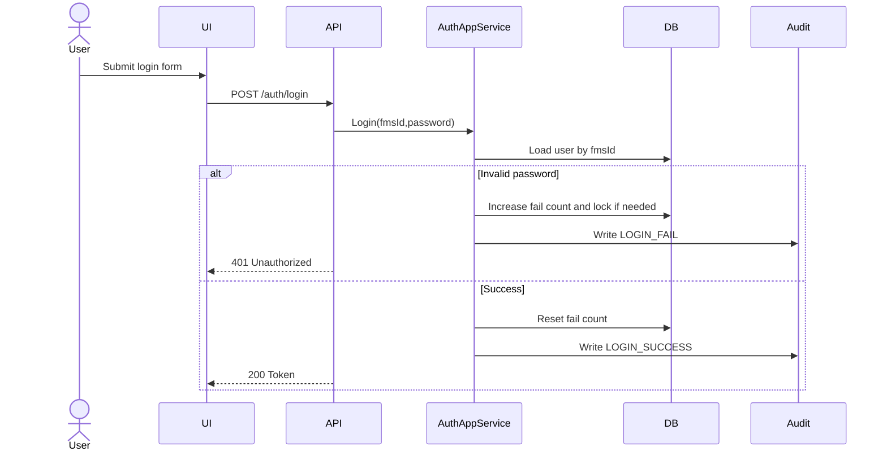
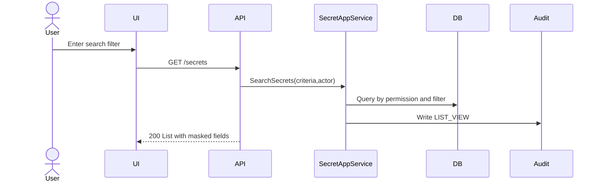
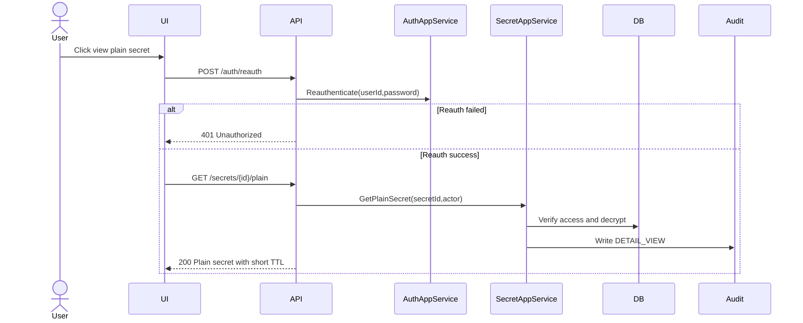
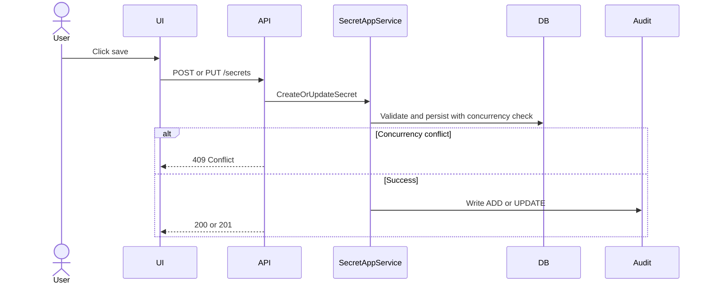
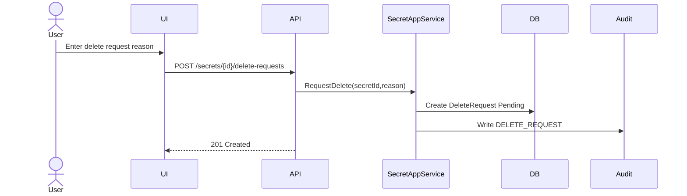
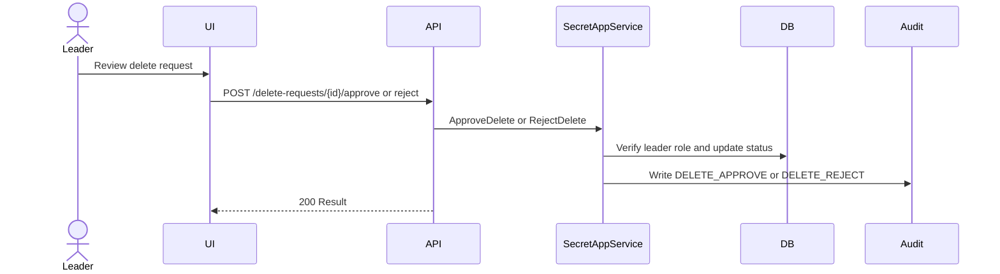
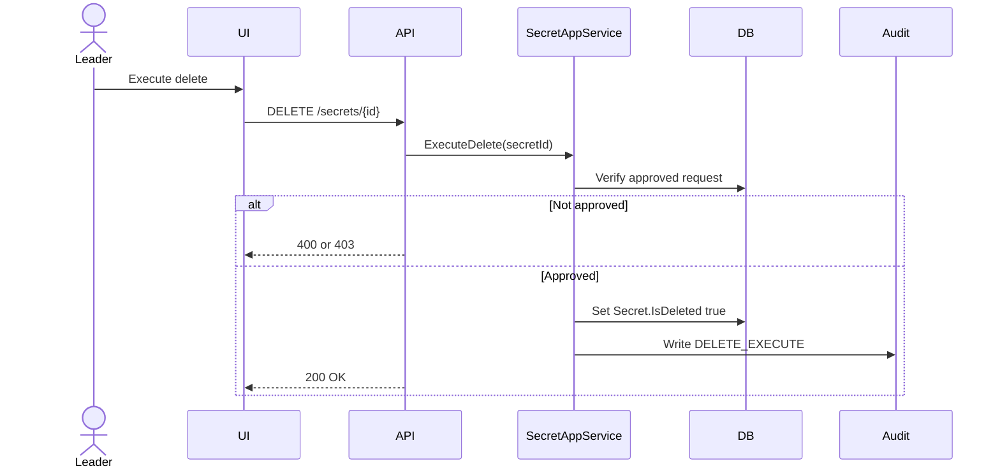
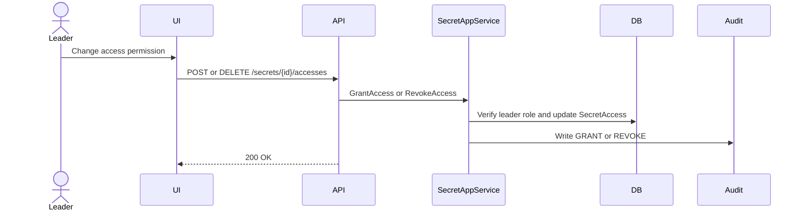

# ESSecrets 핵심 Sequence 시나리오 (우선순위)

본 문서는 팀이 반드시 먼저 맞춰야 하는 핵심 기능 8개의 시퀀스 초안입니다.  
아래 블록은 그대로 `Mermaid` 렌더러에 붙여 다이어그램으로 변환 가능합니다.

용어 기준은 [도메인/키워드 가이드](DOMAIN_KEYWORD_GUIDE.md)를 우선 적용합니다.

## 공통 참여자 표기

- `User`: 팀원/팀장
- `UI`: Vue 화면
- `API`: ASP.NET Core Controller
- `Service`: `AuthAppService` 또는 `SecretAppService`
- `DB`: EF Core + DB
- `Audit`: `AuditLog` 기록 처리

---

## 1) 로그인 / 잠금 처리

## 2) 시크릿 목록 조회 (권한 필터 포함)

## 3) 민감정보 원문 조회 (세션 재인증 포함)

## 4) 정보 추가/수정

## 5) 삭제요청 생성

## 6) 삭제요청 승인/반려

## 7) 실제 삭제 실행 (Soft Delete)

## 8) 정보 접근권한 부여/회수

---

## 필수 예외 분기(모든 시퀀스 공통)

- 권한 없음: `403`
- 인증/세션 문제: `401`
- 대상 없음/삭제됨: `404`
- 동시성 충돌: `409`
- 유효성 오류: `400`
